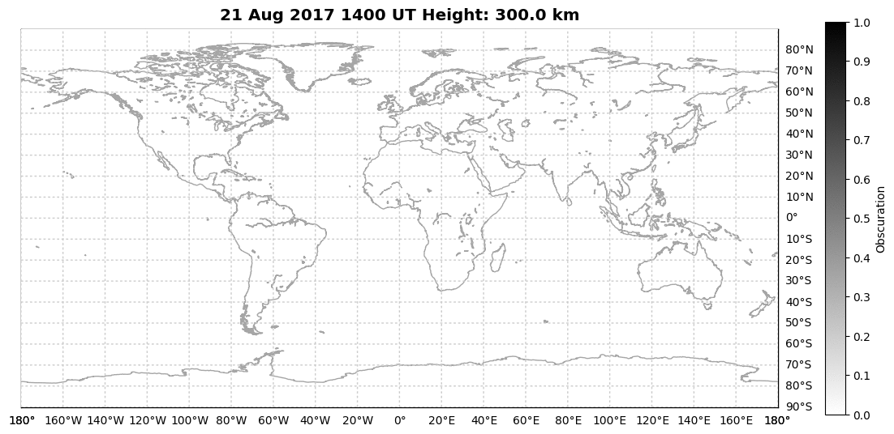

# Eclipse Obscuration Calculator
Inspired by https://gist.github.com/eteq/f879c2fe69d75d1c5a9e007b0adce30d and http://rhodesmill.org/pyephem/tutorial.html.

Note that astropy is *much* slower than PyEphem, but gives you more correct results.
Results from this have been spot-checked against http://xjubier.free.fr/en/site_pages/solar_eclipses/TSE_2017_GoogleMapFull.html.

This repository includes eclipse_maps.py, which will generate world maps and CSV files
of eclipse obscuration. Note that this is *VERY* slow. One run (along with a movie)
has already been completed in the output/ directory.
* This run was completed using 4-character Maidenhead Gridsquare resolution
  (https://en.wikipedia.org/wiki/Maidenhead_Locator_System).
* Obscuration is set to 0 when the sun is more than 18 degrees below the horizon
  (astronomical night). This accounts for the sharp edges seen in the figures.
* Obscuration was calculated at 300 km altitude for purposes of studying
  the ionosphere and HF radio propagation effects.

